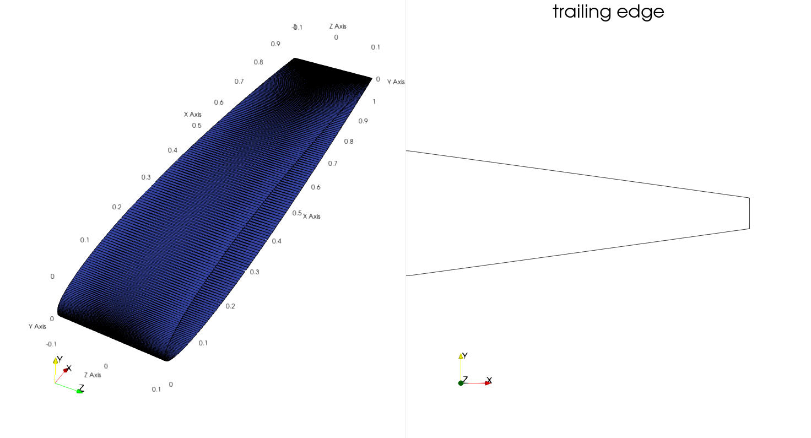

The STL geometry follows a standard NACA-0012 airfoil outline (in the x-y-plane). For meshing in OpenFOAM, it has a depth in z of 0.2 (it extends from -0.1 to 0.1). The trailing edge is not sharp but blunt.

